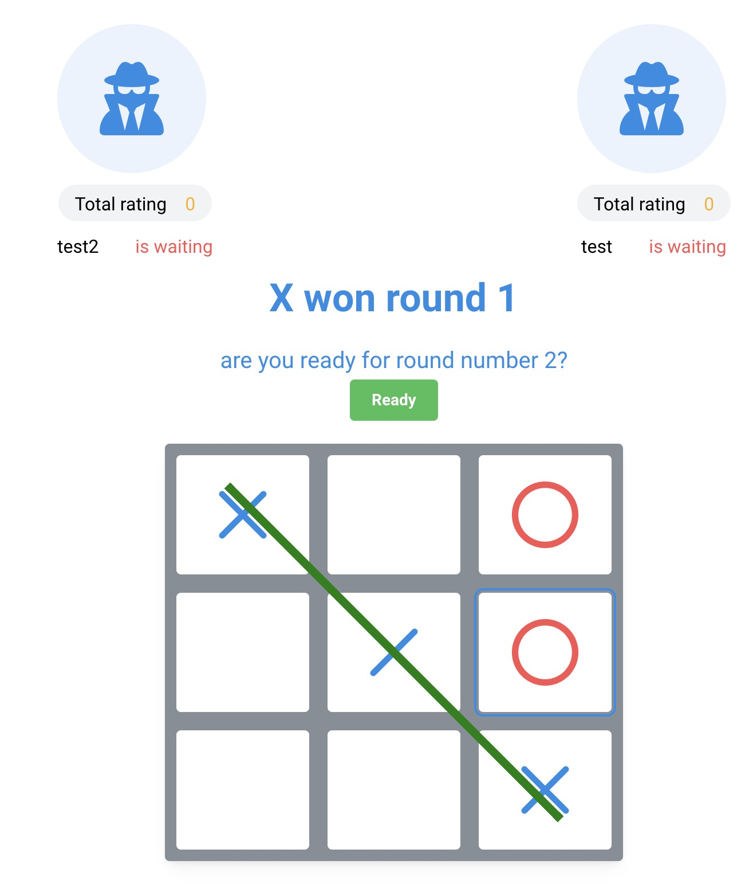

# Tic Tac Toe Online

## Introduction

Welcome to our Tic Tac Toe Online game! This engaging multiplayer game, which you can play completely free of charge, is engineered using React, Next.js, Socket.io, and Mantine UI. Designed as a sleek one-page application, it offers both single-player and multiplayer modes. The multiplayer experience is seamlessly facilitated by Socket.io, ensuring real-time gameplay.



## Getting Started

### Prerequisites

Before diving into the game setup, ensure you have `pnpm` as your package manager. If not, you can install it globally using this command:

```bash
npm install -g pnpm
```

### Setting Up the Project

1. **Clone the Repository**:

   Begin by cloning the repository to your local machine. Replace `{repo-link}` with the actual link to the repository.

   ```bash
   git clone {repo-link}
   ```

2. **Navigate to the Project Directory**:

   Enter the project's root directory using:

   ```bash
   cd {project-directory}
   ```

3. **Install Dependencies**:

   Execute the following command to install all necessary dependencies:

   ```bash
   pnpm install
   pnpm run all:init
   ```

   *Note: If you can't use pnpm, use `npm i && npm run init` in each folder.*

4. **Set Up the Backend Environment**:

   Navigate to the backend folder and create a `.env` file from the template:

   ```bash
   cd backend
   cp .env.example .env
   ```
   The backend will use the port http://localhost:3000/api/ for Swagger.
5. **Set Up the Frontend Environment**:

   Navigate to the frontend folder and create a `.env` file from the template:

   ```bash
   cd frontend
   cp .env.example .env
   ```
   The frontend will be accessible at http://localhost:5173/.
6. **Start the Project**:

   Return to the project root and start the project using:

   ```bash
   cd ..
   pnpm run all:start:dev
   ```

   *Note: If you can't use pnpm, use `npm run dev` in each folder.*

## Contributing

Contributions are what make the open-source community such an amazing place to learn, inspire, and create. Any contributions you make are **greatly appreciated**. Please follow the standard pull request procedure to propose any changes or enhancements.

## License

This project is licensed under the MIT License - see the LICENSE file for details.

## Credits

Special thanks to all contributors and supporters of this project. For more information, acknowledgments, and contact details, please refer to our credits section.

## Done:
1. **User Authentication Established:**
   - Designed and implemented the user schema in the database, including username, email, password, and match history.
   - Developed registration and login functionality using Passport.js with password hashing and validation.
   - Implemented session management with JWT for enhanced security.
2. **Online Game Mechanism Ready:**
   - Completed the Tic-Tac-Toe game logic in TypeScript.
   - Integrated real-time communication using WebSockets and [Socket.IO](http://socket.io/) for dynamic gameplay.
   - Created a matchmaking system to connect players for games.
3. **Testing Conducted:**
   - Performed unit testing on various functions using Jest framework.
4. **Documentation Compiled:**
   - Documented the codebase thoroughly.
   - Utilized Swagger for RESTful API documentation.
   - Prepared a comprehensive README.md file with setup and usage instructions.
5. **Match History Tracker Implemented:**
   - Extended the database schema to include match history.
   - Developed functionality to record and store match details after each game.
   - Implemented a user interface for displaying match history to users.
6. **Training with Boot:** 
   - Successfully completed the boot training module.


### To-Do List:

1. **Change Board Size:**
   - Modify the game board size settings in the application.

2. **Deployment:**
   - Prepare and execute the deployment process for the application.

3. **Implement Google Authentication:**
   - Integrate Google OAuth for user authentication.

4. **Increase Test Coverage:**
   - Write additional tests to improve the test coverage of the application.

5. **Integrate DataDog and Sentry:**
   - Set up DataDog for monitoring and analytics.
   - Implement Sentry for real-time error tracking.

6. **Implement SonarQube for Code Quality:**
   - Set up SonarQube to analyze and improve code quality.

7. **Auto-Generate Interfaces from Swagger:**
   - Develop functionality to automatically create interfaces from the Swagger API documentation.

8. **Implement Recovery Cookies:**
   - Add a feature for cookie-based session recovery.

9. **Develop a Matching System for Player Choice:**
   - Create a system to allow players to choose their opponents.

10. **Incorporate Response Types into Swagger:**
   - Update the Swagger documentation to include response types for APIs.

11. **Add hacky git hooks:**
   - Add git hooks to run tests and linting before pushing to the repository

12. **Enrich Swagger with Request and Response Examples:**
   - Add example requests and responses to the Swagger API documentation.

13. **Implement AbortController for Request Cancellation:**
   - Use AbortController to handle cancellation of HTTP requests.
